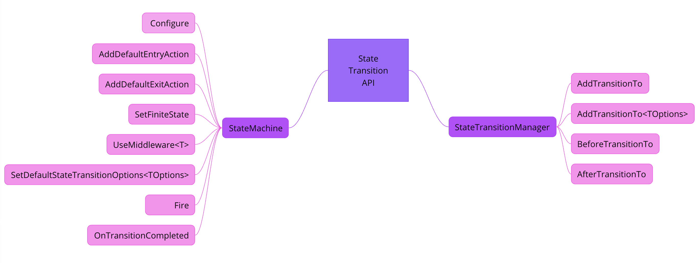

# Overview

The `StateTransition` is a simple, but very handy .NET library for configuring of the state machine.

The API of the `StateTransition` provides complete set of features for flexible and quick configuring the state machine by state or trigger with a number of different useful options.
There is everything you need and no frills.
> `less code, more opportunities`

## Disclaimer
⚠ Although we use it in production, it still isn't v1.0.0. Please, test your configured state machines carefully on dev/stage environments before deploying to the prod.

## Contributing
The `StateTransition` is an open-source project and we will thank you for your contributions to our project. Read the rules [here](./CONTRIBUTING.md).

## Motivation
When you need to orchestrate some business process, then ensuring reliable and flexible orchestration of the process will often depend on the possibilities of the state machine engine.

We are defined 4 important aspects for `StateTransition`'s engine, that we'd like to have for best matching and cover our requirements:
- `loosely coupled & entity-oriented`
- `flexibility`
- `reliability`
- `simplicity`

Well, before developing own implementation we made a short research of the couple similar popular libs for configuring of state machines: [stateless](https://github.com/dotnet-state-machine/stateless)
and [automatonymous](http://masstransit-project.com/Automatonymous/). But these solutions didn’t match all above our requirements.

## Main features

So let's look at the implemented features based on our requirements.
- `loosely coupled & entity-oriented`
  - The configuration of the `StateTransition` engine is built around the working with `TEntity` object type. Under the hood of engine the `low coupling` characteristic and this is confirmed at least by the fact that the `TEntity` type knows nothing about the state-machine itself and that it controls its state. Because of this, the implementation of entity state changes is flexible and adaptive, and you only need to specify the name of the property that will be responsible for the `TEntity` state. So it allows the `StateTransition` to have full control over the process of changing the state of `TEntity`. Moreover, the `StateTransition`'s engine is absolutely state-less.
  - This is an unique and distinctive difference from many other state-machine solutions.
- `flexibility`
  - A flexible way to work with options to control the transition. Out of the box, 1 basic `IsAutofire` option will already be available, which tells the `StateTransition`'s engine that you can automatically fire a transition to the next state without any trigger.
    - The `StateTransition`'s engine provides the ability to set your custom options under each transition.
      - For example, in our services we use the custom `UseTransactionScope` option to specify a `compensable` transaction that will roll back changes that were previously applied before an error occurred in the system.
      - You can override the `IsAutofire` option value if needed for your custom option.
  - It is possible to 
    - pass additional custom arguments available as part of the transition options
    - fire the state transitioning by using `TState` or `TTrigger`
    - to configure custom `entry/exit` actions that are executed before and after a **specific** transition
    - to configure of the default `entry/exit` action that are always executed before and after **any** transition
    - loop the transition to the same `TState` state by using specific `TTrigger`
    - define transition guards to check the condition on a particular transition from the current to the final state
    - build a transitions state graph using Mermaid notation based on a configured state machine
- `reliability`
  - Out of the box, own native `middleware` functionality is available to provide `reliable` control. Let's look at the most basic and useful examples of how to use this functionality by our opinion:
      - ensuring data integrity and consistency to avoid distributed transactions
      - tracing and logging during the transition
      - handling of exceptions that occurred during the transition, etc.
- `simplicity`
  - Easily and handy customizable configuration and to be sure it is enough to get acquainted with [Getting started](#getting-started) section
  
## Performance
```config
BenchmarkDotNet v0.13.12, macOS Sonoma 14.2.1 (23C71) [Darwin 23.2.0]
Apple M1, 1 CPU, 8 logical and 8 physical cores
.NET SDK 7.0.305
[Host]     : .NET 6.0.3 (6.0.322.12309), Arm64 RyuJIT AdvSIMD
Job-VWVFSC : .NET 6.0.3 (6.0.322.12309), Arm64 RyuJIT AdvSIMD

Runtime=.NET 6.0  RunStrategy=Throughput

// * Legends *
Mean   : Arithmetic mean of all measurements
Error  : Half of 99.9% confidence interval
StdDev : Standard deviation of all measurements
Ratio  : Mean of the ratio distribution ([Current]/[Baseline])
1 ns   : 1 Nanosecond (0.000000001 sec)
```

Transitioning by trigger to the specific state with custom transition action and boolean guard can achieve the following benchmark:

| Method | Mean     | Error    | StdDev   | Ratio |
|------- |---------:|---------:|---------:|------:|
| Fire   | 30.24 ns | 0.187 ns | 0.146 ns |  1.00 |

It is worth taking into account that during these `30+ ns` we also had time to set a new value for the `State` property of the related `TEntity` object type.
You can explore our project for benchmarks and run it to verify these calculations! [Here it is](benchmark/StateTransition.Benchmark/OpenClosedStateMachine.cs)!

## Getting Started

To start configure your state machine, all you need to do is declare a new class that will be inherited from the base class
generic class `StateMachine<TState,TTrigger,TEntity>`.

The base class `StateMachine<TState,TTrigger,TEntity>` has 3 types of parameters where

- `TState` allows to describe your type with possible states that can be used to add transitions.
  - Initialization of the state machine involves passing a property with `TState` type responsible for the state of the entity object, which will be updated after the transition to a new status.
- `TTrigger` allows to describe the necessary triggers that will be used to call the transition on the of the state machine.
- `TEntity` allows you to specify the type of entity for which the state machine itself will be configured, with all necessary transitions from one state to another.

Now let's look how to easily start configure your state machine using the below sample.

## Sample with simple state machine

```csharp
public enum AbcState
{
	A,
	B,
	C
}

public enum AbcTrigger
{
	SetB,
	SetC,
	Auto
}

public class Abc
{
	public AbcState State { get; set; }
}

public class AbcStateMachine : StateMachine<AbcState, AbcTrigger, Abc>
{
	public AbcStateMachine(): base(abc => abc.State)
	{
		Configure(AbcState.A)
			.AddTransitionTo(AbcState.B, AbcTrigger.SetB);
		
		SetFiniteState(AbcState.B); // either set the state as finite, or just configure this state. you have to choose one!
	}
    
	public async Task Fire(Abc abc, AbcTrigger trigger)
	{
		await Fire(new FireByTriggerRequest(trigger, abc, CancellationToken.None));
	}
}
```
Now we can use our configured `AbcStateMachine`. Let's fire the transition to the `B` state for `Abc`!
```csharp
var abcStateMachine = new AbcStateMachine();
var abc = new Abc {State = AbcState.A};
await abcStateMachine.Fire(abc, AbcTrigger.SetB);
```

To check out the power of the `StateTransition` engine, - we recommend you start from our [API](#api) section.  
You can use our sample [Abc state machine](sample/StateTransition.AbcSample/AbcStateMachine.cs) as a playground for easier and quicker familiarization with the `StateTransition` features.  
In addition, it will be useful to view our unit tests where we have tried to cover all features logic using our simple sample with `Abc`.

## API

The API of the `StateTransition` has the followed structure:



- [StateMachine](./src/StateTransition/StateMachine.cs) class is responsible for full control over the state machine itself and directly for state transition.
- [StateTransitionManager](./src/StateTransition/StateTransitionManager.cs) class is responsible for managing transitions for an each configured state.

More details about exposed API methods in these classes you can get from their xml-comments in code.
